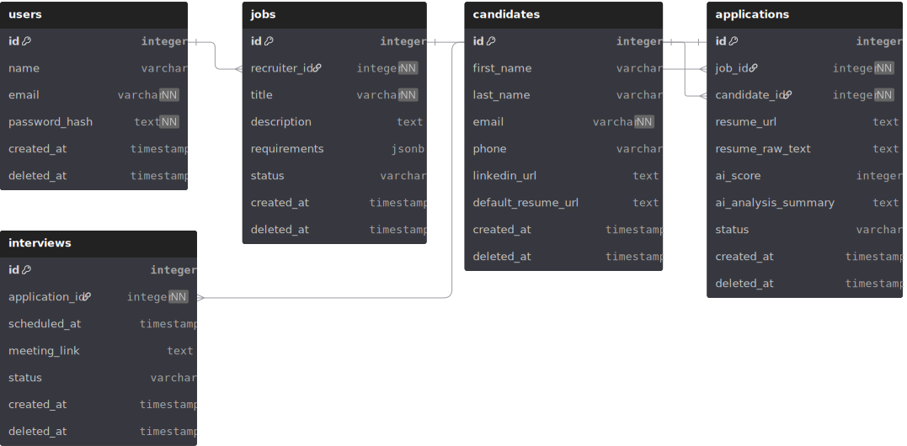

# Entity-Relationship Diagram (ERD) - SieveFlow

This document describes the database architecture for **SieveFlow**, an AI-powered recruitment pipeline. The system is designed to handle job management, candidate tracking, and automated NLP-based resume scoring.

## 📊 Database Schema

---

## 🗂️ Tables Definition

### 1. `users` (Recruiters)

Manages the recruitment staff accounts.

* **Core Logic:** Every job vacancy is owned by a recruiter.

* **Security:** Implements `deleted_at` for soft-deletion of accounts.

### 2. `jobs` (Vacancies)

Defines the positions available and the criteria for the AI analysis.

* **`requirements` (JSONB):** Stores technical keywords and skills as a flexible JSON list to allow high-performance filtering.

* **Relationship:** Belongs to a specific recruiter.

### 3. `candidates` (Applicants)

Centralized profiles for people applying to jobs.

* **`default_resume_url`:** Stores a master resume link. This allows users to apply to multiple roles without re-uploading, while maintaining the option to provide a tailored CV for specific applications.

### 4. `applications` (The Core Pipeline)

The junction table between `jobs` and `candidates`. This is where the "Sieve" happens.

* **`ai_score`:** An integer (0-100) generated by the `nlp-service`.

* **`resume_raw_text`:** Cached plain text from the PDF to allow re-analysis or full-text searches without re-parsing.

* **`status`:** Tracks the candidate's journey (Pending, Screening, Interview, Hired, Rejected, Withdrawn).

### 5. `interviews` (Automation)

Handles the final stage of the pipeline.

* **Automation:** Linked directly to an application to store meeting links and scheduled timestamps.

---

## 🛠️ Architectural Decisions

### Soft Deletes

All major tables include a `deleted_at` column. This ensures **data integrity** and prevents accidental permanent loss of recruitment history. Queries should typically filter for `WHERE deleted_at IS NULL`.

### AI Analysis Storage

Instead of just storing a score, the `applications` table includes an `ai_analysis_summary`. This provides transparency to the recruiter, explaining *why* a candidate received a specific score based on their match with the `jobs.requirements`.

### PostgreSQL JSONB

The use of `JSONB` for requirements allows the system to scale its filtering logic without needing to modify the database schema every time a new requirement type is added.

---

*Created with [dbdiagram.io](https://dbdiagram.io/)*
